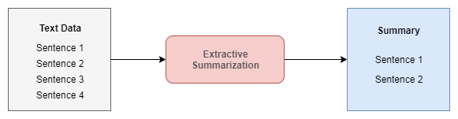
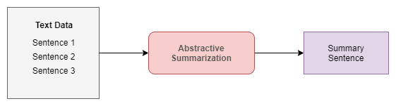

# Text Summarization

Text summarization refers to the technique of shortening long pieces of text. The intention is to create a coherent and fluent summary having only the main points outlined in the document.
Automatic text summarization is a common problem in machine learning and natural language processing (NLP).

There are broadly two different approaches that are used for text summarization:

* Extractive Summarization
* Abstractive Summarization

### Extractive Summarization
The name gives away what this approach does. We identify the important sentences or phrases from the original text and extract only those from the text. Those extracted sentences would be our summary. The below diagram illustrates extractive summarization.

### Abstractive Summarization
This is a very interesting approach. Here, we generate new sentences from the original text. This is in contrast to the extractive approach where we used only the sentences that were present. The sentences generated through abstractive summarization might not be present in the original text.

Text Summarization is implemented with below approches,

* LSTM,Encoder-Decodef and Attention 
* TextRank Algorithm and PyTextRank Text Summarization
* LexRank Text Summarization
* Gensim Text Summarization
* PyTeaser Text Summarization